# Website Site Architecture: Digital Neighbour

*Last updated: June 2026*

This document defines the information architecture, URL hierarchy, navigation structure, and internal linking plan for Digital Neighbour's website. The architecture is engineered to establish topical authority, optimize for crawl speed (essential for AI search engines like ChatGPT and Gemini), and guide local NZ business owners from education to our primary hook: the free **AI Search Readiness Audit**.

---

## 1. Page Hierarchy (ASCII Tree)

We maintain a moderate 3-level depth to stay as flat as possible while organizing our 18 distinct services under logical parent categories.

```
Homepage (/)
├── Services (/services)
│   ├── Search Visibility Hub (/services/search-visibility)
│   │   ├── Traditional SEO (/services/seo)
│   │   ├── Local SEO (/services/local-seo)
│   │   ├── AI SEO (GEO & AEO) (/services/ai-seo)
│   │   ├── E-commerce SEO (/services/ecommerce-seo)
│   │   └── Conversion Rate Optimisation (/services/cro)
│   ├── Website Development Hub (/services/website-development)
│   │   ├── E-commerce Website Development (/services/ecommerce-development)
│   │   ├── WordPress Website Development (/services/wordpress-development)
│   │   ├── Landing Page Development (/services/landing-page-development)
│   │   └── Website Optimisation & Speed (/services/website-optimisation)
│   ├── Google Ads Hub (/services/google-ads)
│   │   ├── Google Search Ads (/services/google-search-ads)
│   │   ├── Google Shopping Ads (/services/google-shopping-ads)
│   │   ├── Google Remarketing (/services/google-remarketing)
│   │   ├── Performance Max Campaigns (/services/performance-max)
│   │   └── Landing Page Optimisation (/services/landing-page-optimisation)
│   └── Other Services Hub (/services/other-services)
│       ├── Call Tracking (/services/call-tracking)
│       ├── Web Hosting (/services/web-hosting)
│       ├── WordPress Hosting (/services/wordpress-hosting)
│       ├── Reseller Hosting (/services/reseller-hosting)
│       └── Email Hosting (/services/email-hosting)
├── AI Search Audit Landing (/ai-readiness-audit)
├── About Us (/about)
├── Blog (/blog)
│   ├── [Category: SEO] (/blog/category/seo)
│   ├── [Category: Google Ads] (/blog/category/google-ads)
│   ├── [Category: AI Search] (/blog/category/ai-search)
│   └── [Category: Web Dev] (/blog/category/web-development)
└── Contact Us (/contact)
```

---

## 2. Visual Sitemap (Mermaid)

```mermaid
graph TD
    %% Nodes
    HOME[Homepage /]
    AUDIT[AI Search Audit /ai-readiness-audit]
    ABOUT[About Us /about]
    BLOG[Blog /blog]
    CONTACT[Contact Us /contact]

    %% Service Category Hubs
    S_VIS[Search Visibility Hub /services/search-visibility]
    S_DEV[Web Development Hub /services/website-development]
    S_ADS[Google Ads Hub /services/google-ads]
    S_OTH[Other Services Hub /services/other-services]

    %% L2 - Search Visibility
    SEO[Traditional SEO /services/seo]
    LSEO[Local SEO /services/local-seo]
    AISEO[AI SEO AEO/GEO /services/ai-seo]
    ESEO[E-commerce SEO /services/ecommerce-seo]
    CRO[Conversion Optimisation /services/cro]

    %% L2 - Web Dev
    EDEV[E-commerce Dev /services/ecommerce-development]
    WDEV[WordPress Dev /services/wordpress-development]
    LDEV[Landing Page Dev /services/landing-page-development]
    WOPT[Website Optimisation /services/website-optimisation]

    %% L2 - Google Ads
    GSRCH[Search Ads /services/google-search-ads]
    GSHOP[Shopping Ads /services/google-shopping-ads]
    GREM[Remarketing /services/google-remarketing]
    PMAX[Performance Max /services/performance-max]
    LPOPT[LP Optimisation /services/landing-page-optimisation]

    %% L2 - Other Services
    CALL[Call Tracking /services/call-tracking]
    HOST[Web Hosting /services/web-hosting]
    WHOST[WordPress Hosting /services/wordpress-hosting]
    RHOST[Reseller Hosting /services/reseller-hosting]
    EHOST[Email Hosting /services/email-hosting]

    %% Subgraphs for Navigation Zones
    subgraph Header_Nav [Header Navigation]
        HOME
        S_VIS
        S_DEV
        S_ADS
        S_OTH
        ABOUT
        BLOG
        AUDIT
    end

    %% Connections
    HOME --> S_VIS
    HOME --> S_DEV
    HOME --> S_ADS
    HOME --> S_OTH
    HOME --> ABOUT
    HOME --> BLOG
    HOME --> CONTACT

    S_VIS --> SEO
    S_VIS --> LSEO
    S_VIS --> AISEO
    S_VIS --> ESEO
    S_VIS --> CRO

    S_DEV --> EDEV
    S_DEV --> WDEV
    S_DEV --> LDEV
    S_DEV --> WOPT

    S_ADS --> GSRCH
    S_ADS --> GSHOP
    S_ADS --> GREM
    S_ADS --> PMAX
    S_ADS --> LPOPT

    S_OTH --> CALL
    S_OTH --> HOST
    S_OTH --> WHOST
    S_OTH --> RHOST
    S_OTH --> EHOST

    %% Directing to Primary CTA
    SEO -.-> AUDIT
    AISEO -.-> AUDIT
    CRO -.-> AUDIT
    WDEV -.-> AUDIT
    GSRCH -.-> AUDIT
    CONTACT -.-> AUDIT
```



---

## 3. URL Map Table

| Page / Service | URL Path | Parent Page | Nav Location | Priority |
| :--- | :--- | :--- | :--- | :--- |
| **Homepage** | `/` | — | Header (Logo) | High |
| **AI Search Audit** | `/ai-readiness-audit` | Homepage | Header Button / CTA | High |
| **About Us** | `/about` | Homepage | Header / Footer | Medium |
| **Blog** | `/blog` | Homepage | Header / Footer | Medium |
| **Contact Us** | `/contact` | Homepage | Header / Footer | High |
| **Search Visibility Hub** | `/services/search-visibility` | Homepage | Header (Dropdown) | High |
| Traditional SEO | `/services/seo` | Search Visibility Hub | Dropdown / Footer | High |
| Local SEO | `/services/local-seo` | Search Visibility Hub | Dropdown / Footer | High |
| AI SEO (AEO / GEO) | `/services/ai-seo` | Search Visibility Hub | Dropdown / Footer | High |
| E-commerce SEO | `/services/ecommerce-seo` | Search Visibility Hub | Dropdown / Footer | Medium |
| Conversion Rate Optimisation | `/services/cro` | Search Visibility Hub | Dropdown / Footer | Medium |
| **Website Development Hub** | `/services/website-development` | Homepage | Header (Dropdown) | High |
| E-commerce Website Dev | `/services/ecommerce-development` | Website Development Hub | Dropdown / Footer | Medium |
| WordPress Website Dev | `/services/wordpress-development` | Website Development Hub | Dropdown / Footer | High |
| Landing Page Dev | `/services/landing-page-development` | Website Development Hub | Dropdown / Footer | Medium |
| Website Optimisation & Speed | `/services/website-optimisation` | Website Development Hub | Dropdown / Footer | Medium |
| **Google Ads Hub** | `/services/google-ads` | Homepage | Header (Dropdown) | High |
| Google Search Ads | `/services/google-search-ads` | Google Ads Hub | Dropdown / Footer | High |
| Google Shopping Ads | `/services/google-shopping-ads` | Google Ads Hub | Dropdown / Footer | Medium |
| Google Remarketing | `/services/google-remarketing` | Google Ads Hub | Dropdown / Footer | Low |
| Performance Max Campaigns | `/services/performance-max` | Google Ads Hub | Dropdown / Footer | Medium |
| Landing Page Optimisation | `/services/landing-page-optimisation` | Google Ads Hub | Dropdown / Footer | Low |
| **Other Services Hub** | `/services/other-services` | Homepage | Header (Dropdown) | Medium |
| Call Tracking | `/services/call-tracking` | Other Services Hub | Dropdown / Footer | Medium |
| Web Hosting | `/services/web-hosting` | Other Services Hub | Dropdown / Footer | Low |
| WordPress Hosting | `/services/wordpress-hosting` | Other Services Hub | Dropdown / Footer | Low |
| Reseller Hosting | `/services/reseller-hosting` | Other Services Hub | Dropdown / Footer | Low |
| Email Hosting | `/services/email-hosting` | Other Services Hub | Dropdown / Footer | Low |

---

## 4. Navigation Spec

### Header Navigation
Designed to group our 18 services into 4 dropdown columns to avoid choices overload (following the 4-7 max items rule).

*   **Logo:** (Left-aligned) links to `/`
*   **Item 1: Search Visibility** (Dropdown Menu):
    *   Traditional SEO (`/services/seo`)
    *   Local SEO (`/services/local-seo`)
    *   AI SEO (AEO/GEO) (`/services/ai-seo`)
    *   E-commerce SEO (`/services/ecommerce-seo`)
    *   Conversion Rate Optimisation (`/services/cro`)
*   **Item 2: Website Development** (Dropdown Menu):
    *   WordPress Website Dev (`/services/wordpress-development`)
    *   E-commerce Website Dev (`/services/ecommerce-development`)
    *   Landing Page Dev (`/services/landing-page-development`)
    *   Website Optimisation & Speed (`/services/website-optimisation`)
*   **Item 3: Google Ads** (Dropdown Menu):
    *   Google Search Ads (`/services/google-search-ads`)
    *   Google Shopping Ads (`/services/google-shopping-ads`)
    *   Performance Max Campaigns (`/services/performance-max`)
    *   Google Remarketing (`/services/google-remarketing`)
    *   Landing Page Optimisation (`/services/landing-page-optimisation`)
*   **Item 4: Other Services** (Dropdown Menu):
    *   Call Tracking (`/services/call-tracking`)
    *   Web Hosting & WordPress Hosting (`/services/web-hosting`)
    *   Reseller Hosting (`/services/reseller-hosting`)
    *   Email Hosting (`/services/email-hosting`)
*   **Item 5: About Us** (`/about`)
*   **Item 6: Blog** (`/blog`)
*   **CTA Button (Rightmost):** "Free AI Search Audit" (links to `/ai-readiness-audit`)

### Footer Organization
Structured in columns to act as an exhaustive sitemap:

*   **Column 1: Search Visibility**
    *   Traditional SEO
    *   Local SEO
    *   AI SEO (AEO / GEO)
    *   E-commerce SEO
    *   Conversion Rate Optimisation (CRO)
*   **Column 2: Web Development**
    *   WordPress Development
    *   E-commerce Development
    *   Landing Page Development
    *   Website Optimisation
*   **Column 3: Google Ads**
    *   Google Search Ads
    *   Google Shopping Ads
    *   Performance Max
    *   Google Remarketing
    *   Landing Page Optimisation
*   **Column 4: Managed Tech**
    *   Call Tracking
    *   Web Hosting
    *   WordPress Hosting
    *   Reseller Hosting
    *   Email Hosting
*   **Column 5: Company**
    *   About Us
    *   Blog
    *   Contact Us
    *   Privacy Policy
    *   Terms of Service

### Breadcrumbs Pattern
Implemented on all L2 pages to reinforce parent hierarchy and internal link strength:
*   `Home > Services > Search Visibility > AI SEO (GEO & AEO)`
*   `Home > Blog > Category > Post Title`

---

## 5. Internal Linking Plan

To climb to the **Top 1% of NZ Search Agencies**, we structure our pages in tight Hub-and-Spoke networks to maximize semantic context and pass page rank down from main hubs to specific spokes.

### Hub-and-Spoke Topic Clusters

#### Cluster 1: Search Visibility (Core Service Hub - 60% Revenue)
*   **Hub Page:** `/services/search-visibility` (Provides a plain English overview of the search landscape shift, using our Yellow Pages to Google / smartphone shift analogies).
*   **Spokes:** `/services/seo`, `/services/local-seo`, `/services/ai-seo`, `/services/ecommerce-seo`, `/services/cro`.
*   **Linking Rules:** The Hub links out to all 5 spokes. Every spoke links back to the `/services/search-visibility` hub with anchor text matching the service name. Spoke pages also interlink (e.g., `/services/local-seo` links to `/services/ai-seo` as the future of local business lookup).

#### Cluster 2: Website Development (20% Revenue)
*   **Hub Page:** `/services/website-development` (Focuses on building fast, SEO-friendly assets that act as a business foundation).
*   **Spokes:** `/services/wordpress-development`, `/services/ecommerce-development`, `/services/landing-page-development`, `/services/website-optimisation`.
*   **Linking Rules:** Hub page connects to all spokes. Every spoke links back to `/services/website-development`. The spoke `/services/website-optimisation` links to `/services/wordpress-development` to reference speed improvements.

#### Cluster 3: Google Ads (10% Revenue)
*   **Hub Page:** `/services/google-ads` (Focuses on Ads as an ongoing lead engine).
*   **Spokes:** `/services/google-search-ads`, `/services/google-shopping-ads`, `/services/performance-max`, `/services/google-remarketing`, `/services/landing-page-optimisation`.
*   **Linking Rules:** Hub page links to all spokes. Every spoke links back to `/services/google-ads`.

### Cross-Section Linking Opportunities

1.  **Connecting Web Dev to SEO (The Foundation Analogy):** On `/services/wordpress-development` and `/services/ecommerce-development`, link directly to `/services/seo` and `/services/website-optimisation` with anchor text like *"clean technical SEO foundation"* or *"speed optimization"*. Cite our signature analogy: *"A website is the foundation of a house, and SEO is the house itself. If the foundation is weak, the walls crack."*
2.  **Connecting Google Ads to CRO and Landing Pages:** On `/services/google-search-ads` and `/services/performance-max`, link to `/services/cro` and `/services/landing-page-optimisation` with text like *"improving landing page conversion rates"*. Cite the QA check rule: *"A broken contact form or bad landing page can cost thousands in wasted ad spend."*
3.  **Audit Hook CTA Anchor:** Every L2 service page (especially `/services/ai-seo`, `/services/seo`, `/services/local-seo`, `/services/cro`) must feature a distinct Call-to-Action section linking to `/ai-readiness-audit`. The anchor text should promote the *"Free NZ AI Search Readiness Audit"* to compare their business against local competitors.
4.  **Blog to Service Linking:** Every educational blog post in a category must link to its corresponding L2 service page within the first 150 words (e.g., a post about Siri voice search links to `/services/ai-seo`).
